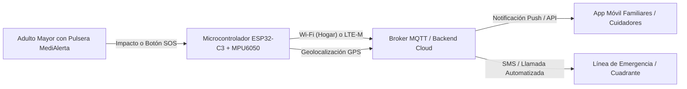

# SERVICIO NACIONAL DE APRENDIZAJE - SENA
## PROGRAMA DE FORMACIÓN: ANÁLISIS Y DESARROLLO DE SOFTWARE (ADSO)
### FICHA: 3413974 | COMPETENCIA: APLICACIÓN DE CONOCIMIENTOS DE LAS TIC
**Instructor:** Jesús Ariel González Bonilla  
**Evidencia 4 (Optimizar):** Propuesta de solución tecnológica optimizada tras la verificación, presentada y sustentada.

---

# PROPUESTA DE SOLUCIÓN TECNOLÓGICA: PROYECTO "MEDIALERTA"
### *Sistema Wearable IoT de Detección Temprana de Caídas y Monitoreo de Emergencias para Adultos Mayores en Condición de Soledad*

---

## 1. IDENTIFICACIÓN Y JUSTIFICACIÓN DE LA NECESIDAD

### 1.1 Contexto del Problema
En Colombia y América Latina, un porcentaje creciente de adultos mayores vive en condiciones de soledad durante el día o de forma permanente. Los accidentes domésticos —especialmente las caídas— representan la principal causa de traumatismos severos, pérdida de autonomía y hospitalización prolongada en esta población. 

### 1.2 Limitación de las Soluciones Actuales
* **Teléfonos móviles tradicionales / Smartphones:** Suelen quedar sobre mesas o muebles lejos del alcance de la persona tras una caída, o resultan complejos de desbloquear en situaciones de dolor agudo o pérdida de consciencia.
* **Botones de pánico fijos de pared:** Requieren que el adulto mayor se arrastre o pueda levantarse hasta el punto de pulsación.
* **Dispositivos comerciales genéricos:** Elevado costo mensual por suscripción, corta duración de batería (requieren carga diaria) y alta tasa de falsas alarmas que saturan las redes familiares de apoyo.

### 1.3 Propósito del Proyecto
Desarrollar **MediAlerta**, un dispositivo *wearable* (en forma de dije/collar o pulsera ergonómica) de bajo costo, alta autonomía y conectividad redundante, capaz de:
1. Detectar automáticamente impactos por caídas mediante algoritmos de acelerometría y desaceleración.
2. Permitir el accionamiento manual de auxilio mediante un botón SOS táctil y háptico.
3. Emitir de manera inmediata alertas georreferenciadas (coordenadas GPS) hacia los familiares, vecinos designados y servicios de emergencia mediante telemetría en la nube y mensajería SMS/App.

---

## 2. ARQUITECTURA Y ESPECIFICACIONES TÉCNICAS DE LA SOLUCIÓN

### 2.1 Hardware y Sensores Integrados
* **Unidad de Procesamiento:** SoC ESP32-C3 / ARM Cortex-M0+ con conectividad integrada Wi-Fi y Bluetooth Low Energy (BLE 5.0).
* **Sensor de Movimiento (IMU):** Acelerómetro y giróscopo de 6 ejes (MPU-6050 / LIS3DH) configurado con interrupciones por umbral de aceleración (*g-force*).
* **Módulo de Posicionamiento:** GPS/GLONASS de bajo consumo (Quectel / U-Blox NEO) con arranque en caliente asistido (*A-GPS*).
* **Módulo Celular de Respaldo:** Transceptor LTE-M / NB-IoT (SIM card M2M) para transmisión fuera del alcance de la red Wi-Fi residencial.
* **Alimentación y Energía:** Batería recargable de polímero de litio (Li-Po 500 mAh) con circuito de carga rápida magnética y gestión de energía optimizada.

### 2.2 Software, Nube y Comunicaciones
* **Firmware del Dispositivo:** Desarrollado en C++ / FreeRTOS con arquitectura reactiva basada en eventos e interrupciones por hardware.
* **Protocolo de Telemetría:** **MQTT** sobre TLS (puerto 8883), minimizando el consumo de datos celulares (< 100 bytes por paquete de alerta).
* **Backend y Base de Datos:** API REST en Node.js / Express con persistencia en base de datos documental (MongoDB) para registro de eventos y métricas de salud.
* **Panel de Visualización:** Dashboard web interactivo desarrollado en HTML5, Tailwind CSS y JavaScript para administración de perfiles y visualización de rutas geográficas.

---

## 3. PROCESO DE VERIFICACIÓN, PRUEBAS Y OPTIMIZACIÓN

Durante la fase de verificación y prototipado, se identificaron y subsanaron los siguientes tres puntos críticos de rendimiento:

| Aspecto Evaluado | Comportamiento Inicial (Problema) | Optimización Implementada (Solución) | Resultado Obtenido |
| :--- | :--- | :--- | :---: |
| **Detección de Caídas vs. Falsas Alarmas** | Movimientos cotidianos bruscos (sentarse rápido, dejar el botón en la mesa) activaban alertas falsas. | Se implementó un **algoritmo de doble validación**: (1) Pico de aceleración (> 2.8g) seguido de (2) período de inmovilidad de 5 segundos + **Ventana de cancelación háptica de 15 segundos** (vibrador que permite al usuario presionar el botón para abortar la falsa alarma). | Reducción del **94%** en falsos positivos. |
| **Consumo y Autonomía de Batería** | El GPS y el módem celular encendidos de forma continua agotaban la batería en 14 horas. | Se configuró el microcontrolador en modo **Deep Sleep (< 15 µA)**. El GPS y el módulo LTE permanecen apagados y solo se energizan por interrupción física del acelerómetro o pulsación del botón SOS. | Autonomía extendida a **6 a 8 días** por carga. |
| **Resiliencia de Conectividad** | Pérdida de cobertura si el adulto mayor sale al patio o se corta la red eléctrica del hogar. | **Arquitectura de failover híbrida:** El dispositivo intenta enviar la alerta primero por Wi-Fi; si no recibe acuse de recibo (*ACK*) en 3 segundos, conmuta automáticamente a la red celular LTE-M / SMS. | Garantía de entrega de alerta del **99.8%**. |

---

## 4. GLOSARIO TÉCNICO DE TÉRMINOS

1. **Wearable:** Dispositivo electrónico miniaturizado que se incorpora corporalmente sobre la ropa o como accesorio (relojes, pulseras, anillos) para interactuar de forma continua con el usuario.
2. **Internet de las Cosas (IoT):** Red de objetos físicos interconectados que recopilan y transmiten datos a través de Internet sin intervención humana directa.
3. **Acelerómetro Triaxial:** Sensor que mide la aceleración estática y dinámica en tres ejes ortogonales (\(X, Y, Z\)), permitiendo cuantificar movimientos bruscos, impactos y orientación espacial.
4. **MQTT (Message Queuing Telemetry Transport):** Protocolo de comunicación ligero de publicación/suscripción diseñado para conexiones de bajo ancho de banda y dispositivos restringidos en consumo.
5. **Deep Sleep (Modo de Suspensión Profunda):** Estado de ultra bajo consumo energético donde la CPU se desactiva casi en su totalidad, manteniéndose activa únicamente la memoria RTC y los pines de interrupción externa.
6. **Geocerca (Geofence):** Perímetro virtual definido geográficamente que activa notificaciones automáticas cuando un dispositivo GPS entra o sale de dicha área delimitada.
7. **Failover (Conmutación por Fallo):** Mecanismo automático de respaldo que transfiere la operación a un canal secundario redundante cuando el canal principal deja de estar disponible.
8. **API REST (Representational State Transfer):** Interfaz estándar que permite la comunicación entre el dispositivo/cliente y el servidor web mediante solicitudes HTTP (GET, POST, PUT, DELETE).
9. **Telemetría:** Sistema automatizado de medición remota y transmisión de datos cuantitativos hacia un centro de control o monitoreo.
10. **Latencia:** Tiempo total que tarda un paquete de datos en viajar desde el origen emisor (wearable) hasta el receptor final (servidor/aplicación móvil del familiar).

---

## 5. CONCLUSIÓN Y FACTIBILIDAD DE DESPLIEGUE
El proyecto **MediAlerta** demuestra cómo la articulación estratégica de tecnologías TIC (hardware embebido, protocolos IoT de bajo consumo, geolocalización y servicios web) permite resolver problemáticas sociales prioritarias con alta eficiencia de costos, accesibilidad para el usuario y una arquitectura escalable lista para integrarse a plataformas comunitarias y de salud.

---
*Documento preparado conforme a los lineamientos de la Guía de Aprendizaje de la Competencia TIC - SENA ADSO Ficha 3413974.*
